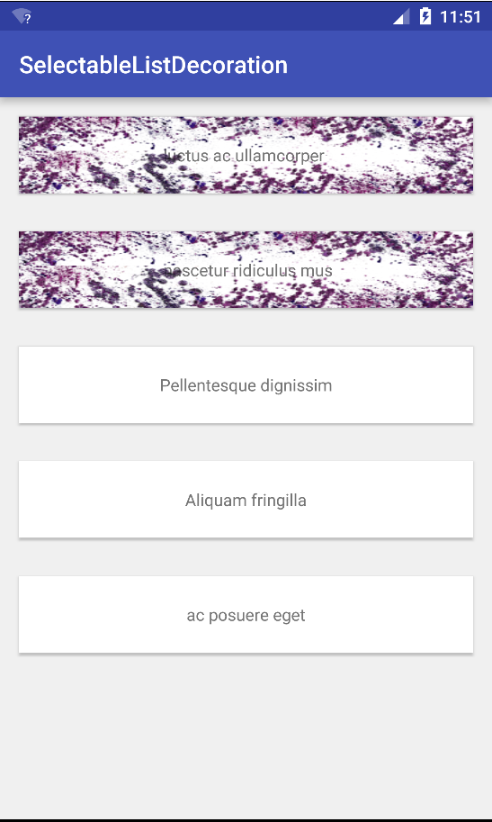
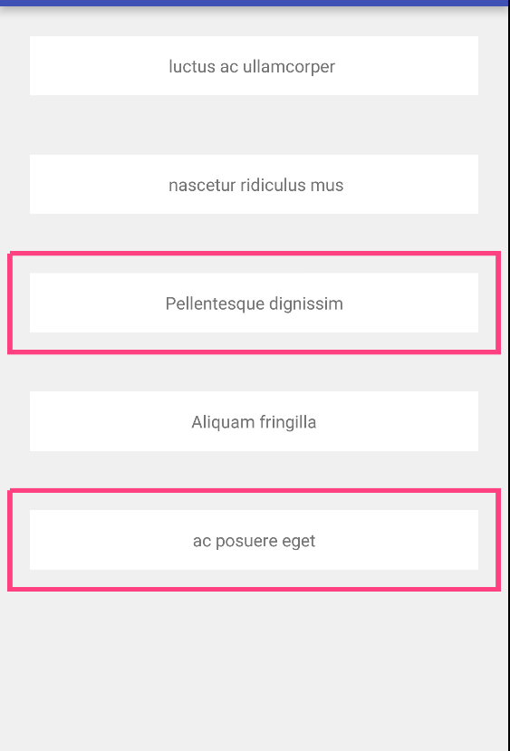

# An Item decoration class for google design lib's RecyclerView

## What's it for?
This class is for decorating a recyclerview's item that the decorator has deemed as "Selected"
the criteria for selection is decided by the decorator when it calls the recyclerview adapter's 
`isSelected(int position)` method. Therefore as a pre-requisite you must implement the SelectableAdapter 
interface in the `Recyclerview`'s adapter to which you are adding the decoration to. 

## Sample Screenshots:



## Including in gradle:

Add to your root build.gradle:

```
allprojects {
    repositories {
        maven { url "https://jitpack.io" }
    }
}
```

Add to your module (app) build.gradle:

```
dependencies {
    compile 'com.github.bhargavms:SelectableListDecoration:1.0.0'
}
```

## How to use:
 - Instantiate the class and add it to your recyclerview like so:
```
list.addItemDecoration(new SelectedItemDecoration(getColor(R.color.colorAccent), getResources().getDimension(R.dimen.stroke_width)));
```

 - Implement the `SelectedItemDecoration.SelectableAdapter` Interface In your `RecyclerView.Adapter` extension like so:
```
public class ListAdapter extends RecyclerView.Adapter<ListAdapter.ViewHolder>
        implements SelectedItemDecoration.SelectableAdapter
```

 - In the `isSelected(int position)` method implementation of your adapter class (inherited from the `SelectedItemDecoration.SelectableAdapter` interface) write the logic to decide if the current item (decided from the position value) is selected or not. (You can do this in multiple ways, for example in the sample app I have mainted a `Map<Integer,Boolean>` to decide if  the view is selected)


## Features:
- Defaults to a stroke only rectangle as shown in screen shot number 2.
- Supports adding Drawables, the drawables get drawn over the recyclerview item, as shown in screenshot number 1.

```
list.addItemDecoration(new SelectedItemDecoration(getResources()
                .getDrawable(R.drawable.border_purple_texture_scaled)));
```

## LICENSE:
[Apache 2.0](LICENSE)